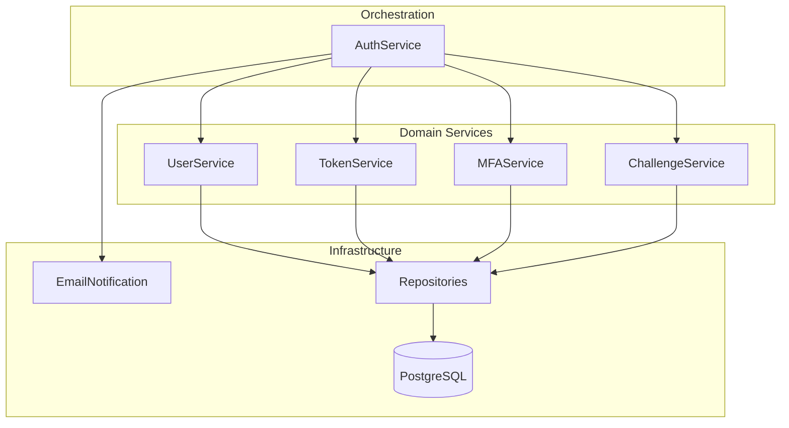
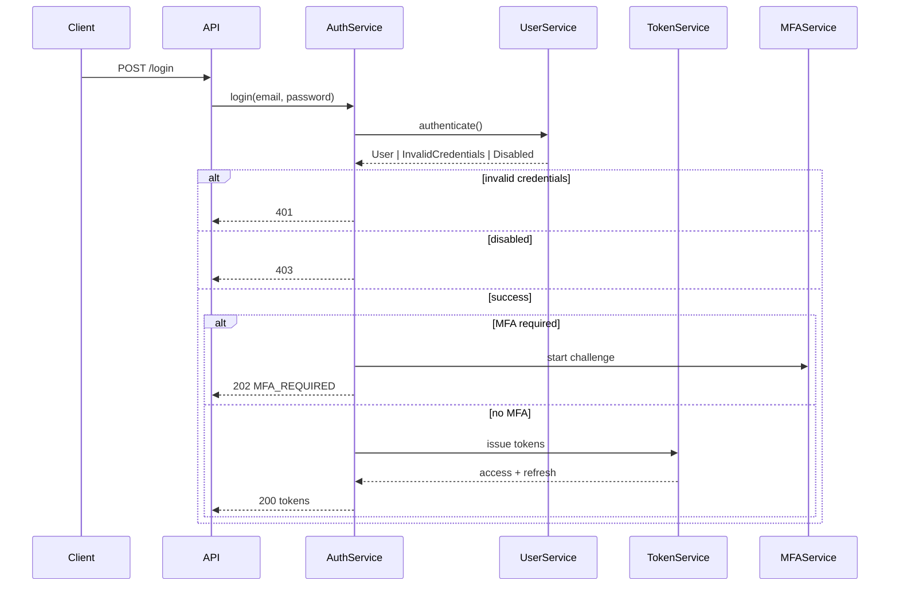
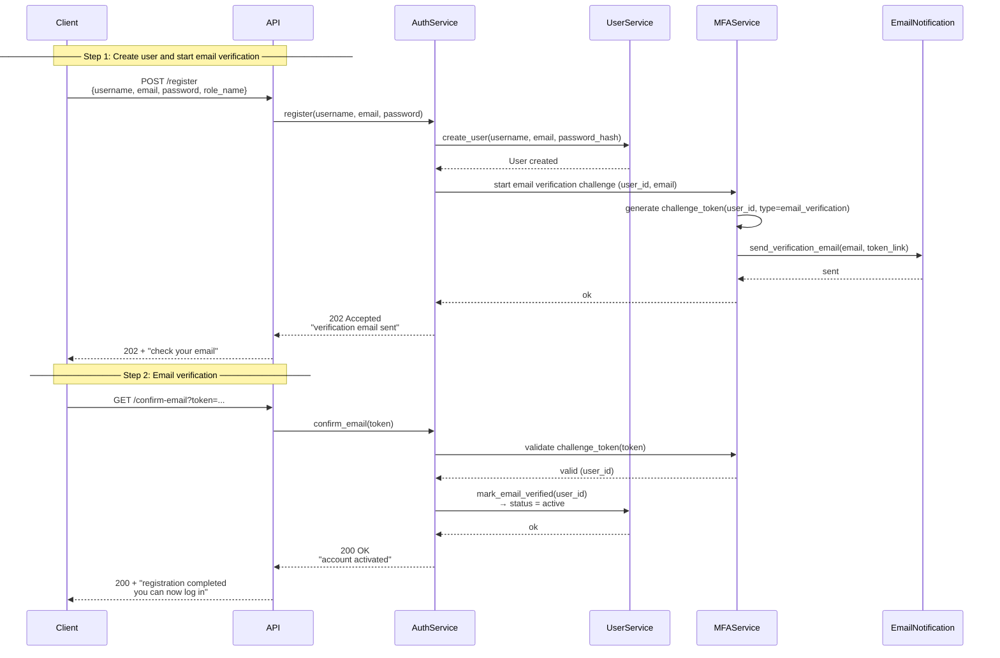

# Auth service
Async authentication service with JWT-based access control, refresh token rotation, and multi-factor authentication.

## Features

- ✅ Registration & email verification  
- 🛡 JWT authentication (access & refresh tokens)  
- 🔄 Token lifecycle (rotation, revocation)  
- 🔑 MFA (TOTP / email)  
- 🔐 Password hashing (bcrypt)  
- ⚙️ Async FastAPI backend  
- 🐳 Docker support  
- 🧪 Tests (unit, integration, e2e)  

## Tech Stack

- **Backend:** Python3, FastAPI (async)
- **Database:** PostgreSQL(asyncpg), SQLAlchemy
- **Infrastructure:** Docker, Docker Compose
- **Security:** cryptography, bcrypt
- **Testing:** pytest (unit, integration, e2e)

## Installation

1. Clone repository
```sh
git clone https://github.com/Tepex651/auth-service.git
cd auth-service
cp .env.example .env
```

2. Install Dependencies (`uv` used as package manager)
```sh
# install uv
pip install uv  # see https://docs.astral.sh/uv/getting-started/installation/

uv sync
```

3. Deploy and Run

```sh
# setup db, mailhog and app
docker compose up -d

# db-migrate
uv run alembic upgrade head

# run tests
uv run pytest tests/unit
uv run pytest tests/integration
uv run pytest tests/e2e

# to see logs
docker compose logs
```
<details>
<summary> make </summary>

```sh
# setup db, mailhog and app
make setup-local

# db-migrate
make migrate

# run tests
make e2e-tests

# to see logs
make logs
```
</details>

## Architecture & Flows

<details>
<summary>📦 Domain Boundaries Diagram</summary>

### Layers
- Orchestration: coordinates authentication flows
- Domain services: encapsulate business rules
- Infrastructure: external integrations and persistence



### Responsibilities
- **AuthService** — orchestrates authentication flows (login, refresh, MFA, reset)
- **UserService** — user lifecycle and identity state
- **TokenService** — issuing, rotating, revoking tokens
- **MFAService** — multi-factor authentication flows
- **ChallengeService** — multi-step auth continuations
- **EmailNotification** — outbound notification delivery
- **Repositories** — persistence abstraction

</details>

<details> <summary>🔐 Login Flow</summary>

### Actors
- Client - browser, mobile app or another backend service
- API - FastAPI HTTP layer
- AuthService - authentication logic (credentials validation)
- TokenService - access/refresh token lifecycle
- UserService - creating user in db
- MFAService - create mfa challenge token and verify



</details>

<details> <summary>📝 Registration Flow</summary>

### Actors
- Client - browser, mobile app or another backend service
- API - FastAPI HTTP layer
- AuthService - orchestration layer. Pass control to UserService
- UserService - create user in DB
- MFAService - create mfa challenge token and verify
- EmailNotification - send email message


</details> 

## Configuration

```
DB_HOST=localhost
DB_PORT=5432
DB_USER=postgres
DB_PASSWORD=password
DB_NAME=iam
DB_CONN_POOL_SIZE=20
DB_CONN_MAX_OVERFLOW=10

# use it for test/local development only (openssl rand -hex 32)
SECRET_KEY=7e23e1a55eea04523ec90c86554b5640d2c1f6919e89efa9bb0a56efde5e7cf3

SMTP_TOKEN=0a5e54b0d9f685a652fcae6425af58af
SMTP_HOST=127.0.0.1
SMTP_PORT=1025
SMTP_WEB_PORT=8025

REDIS_HOST=localhost
REDIS_PORT=6379
# use it for test/local development only (openssl rand -base64 32)
ENCRYPTION_CURRENT_KEY=YADrK143ZO9TGwKAHKWr1QhRsUDqBj4_4_DtiH-QA-w=

LOG_LEVEL=DEBUG
BCRYPT_COST=4

APP_HOST=0.0.0.0
APP_PORT=8000
```

## License

MIT License © 2026
